Калимуллина Анита Робертовна ИС-22-9/1


# Эта база данных моделирует информацию о больнице, включая данные о врачах, пациентах, специальностях и больничных листах, премах и расписаниях. 


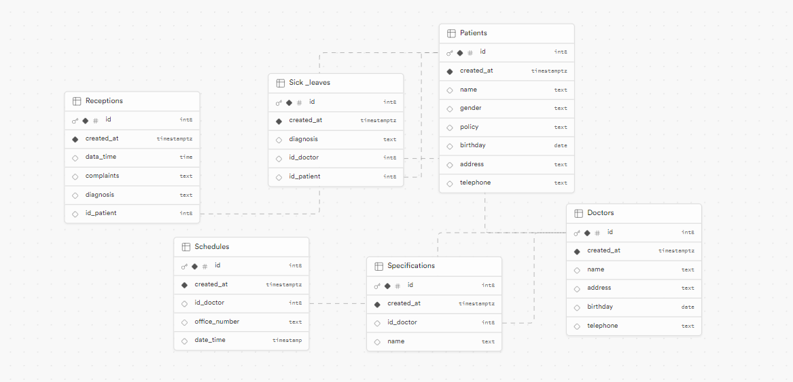

## Сущности (Таблицы)

### 1. doctors


-doctors_id (INTEGER) - уникальный индефикатор доктора 

-name (TEXT) - фио доктора

-adress (TEXT) - адрес доктора

-birthday (DATE) - дата рождения доктора

-telephone (TEXT) - номер телефона доктора
       


### 2. patients


-patients_id (INTEGER) - уникальный индефикатор доктора 

-name (TEXT) - фио пациента

-adress (TEXT) - адрес пациента

-birthday (DATE) - дата рождения пациента

-telephone (TEXT) - номер телефона пациента

-gender (TEXT) - пол пациента

-policy (TEXT) - номер страхового полиса пациента


### 3. receptions


-receptions_id (INTEGER) - уникальный индефикатор приёма 

-patients_id (INTEGER) - индефикатор пациента, связан с таблицей patients по полю patients_id

-data_time (DATATIME) - дата и время приема пациента

-complaints (TEXT) - жалобы пациента

-diagnosis (TEXT) - диагноз пациента


### 4. schedules


-schedules_id (INTEGER) - уникальный индефикатор расписания

-doctors_id (INTEGER) - индефикатор доктора, связан с таблицей doctors по полю doctors_id

-office_number (TEXT) - номер кабинета

-data_time (DATATIME) - дата и время приема в кабинете


### 5. sick_leaves


- sick_leaves_id (INTEGER) - уникальный индефикатор больничного листа

-doctors_id (INTEGER) - индефикатор доктора, связан с таблицей doctors по полю doctors_id

-patients_id (INTEGER) - индефикатор пациента, связан с таблицей patients по полю patients_id

-diagnosis (TEXT) - диагноз пациента


### 6. specialtions


-specialtions (INTEGER) - уникальный индефикатор специализации

-doctors_id (INTEGER) - индефикатор доктора, связан с таблицей doctors по полю doctors_id

-name (TEXT) - название специализации доктора


## Демонстрация работы функций:

### 1. UNION 

```
	SELECT name

		FROM doctors

		UNION

	SELECT name

		FROM patients
	
```


Этот запрос выбирает все имена из таблицы patients, из таблицы doctors и обьединяет их, удаляя дубликаты. В результате выполнения этого кода был получен список уникальных имен, которые встречаются либо в таблице doctors, либо в таблице patient.

### 2. ORDER BY

```

	SELECT name, birthday 

		FROM patients 

	ORDER BY birthday DESC

```


Этот запрос выбирате имена и дату рождения из таблицы patients и сортирует результаты по дате рождения в порядке убывания. В итоге, этот код выводит список пациентов, отсортированных по дате рождения.

### 3. HAVING

```

	SELECT diagnosis, patients_id

		FROM sick_leaves

	GROUP BY diagnosis

		HAVING diagnosis = 'грипп'

```


Это запрос выбирает диагнозы и id пациентов из таблицы sick_leaves, группирует результаты по столбцу diagnosis и фильтрует записи, оставляя только те, где значение столюца diagnosis = "грипп". В результате был получен id пациента который болеет гриппом.

### 4. SELECT 

```
	SELECT doctors_id, diagnosis

	FROM sick_leaves


```


Этот запрос выбирает id докторов и диагнозы из таблицы sick_leaves. В результате была получена таблица с id докторами и диагнозами которые они лечат.

### 5. WHERE
 
```
	SELECT name

	FROM patients

	WHERE name NOT LIKE '%a'


```


Этот запрос выбират имена из таблицы pateents и фильтрует имена, кторые не заканчиваютсяна букву "а". В итоге, мы получаем имена пациентов, которые не заканчиваются на букву "а".

## Демонстрация работы оконных функций:

# Агрегатные функции:

### 1. COUNT

```

	SELECT name, COUNT (*) AS amount FROM specialtions

	GROUP BY name

	ORDER BY amount  DESC

```


Этот запрос выбирает столбец name, подсчитывает количество строк для каждой группы с помощью COUNT и назначает результат псевдониму amount, все данные берутся из таблицы specialtions, группирует строки по значению столбца name, сортирует результат по столбцу amount. В результате этот код выдает список специализации с соответствующем количеством специалистов.

### 2. MAX 

```
	SELECT MAX(length(name))

		AS самое_длинное_название_специальности 

	FROM specialtions
	
```


Этот запрос вычисляет длину в каждом значении столбца name и находит максимальное значение длины среди всех специализаций. В итоге этот код выводит число самого длинного названия специализации.

### 3. MIN 

```
	SELECT doctors_id, 
		
		MIN(data_time) AS самая_поздняя_запись_каждого_врача
	
	FROM schedules

	GROUP BY doctors_id
	
```

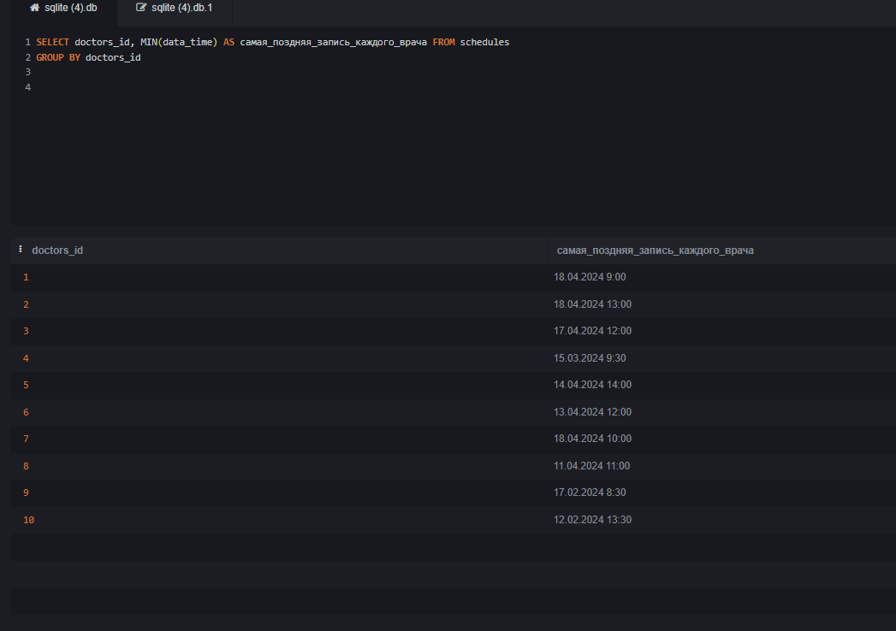

Этот запрос выбирает id врача и находит минимальное значение столбца data_time. В результате этот код выводит id врачей и самую позднюю запись для каждого врача.

# Ранжирующие функции:

### 1. RANK

```

	SELECT name, RANK() OVER (ORDER BY birthday) AS doctor_rank

	FROM doctors

```


Этот запрос выбирает имена врачей и присваевает ранг каждому врачу на основе их даты рождения. В итоге, выводятся имена врачей и ранг присвоенный каждому врачу.

### 2. DENSE_RANK

```

	WITH Numbered_ Patients AS (

		SELECT *,

			DENSE_RANK() OVER(ORDER BY birthday) AS rank

		FROM patients )

	SELECT * FROM Numbered Patients

```

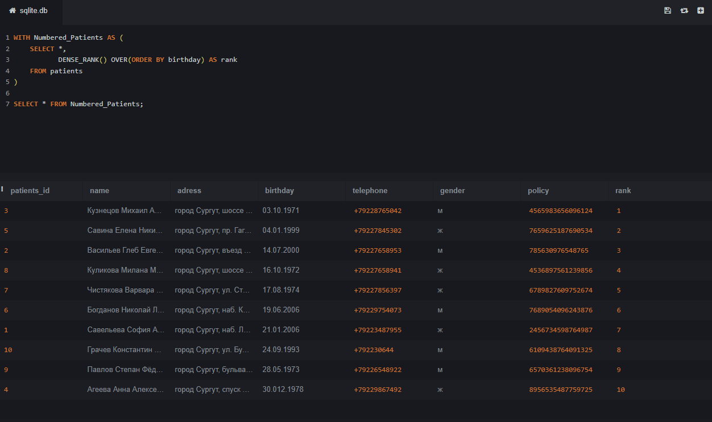

Этот код выдает таблицу со всеми данными пациентов, а также дополнительный столбец "rank" котогрый содержит уникальный номет для каждого пациента, основанный на их дате рождения.

### 3. ROW_NUMBER

```

	WITH Numbered_Doctors AS (

		SELECT *,
		
		ROW_NUMBER() OVER(ORDER BY birthday DESC) AS row_num

		FROM doctors )

	SELECT * FROM Numbered_Doctors

```

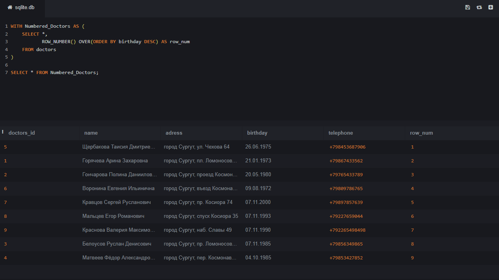

Этот код выдает таблицу со всеми данными врачей, а также дополнительный столбец "row_num" котогрый содержит уникальный номет для каждого врача, основанный и отсортированный по их дате рождения.

### 4. NTILE

```

	WITH Grouped_Patients AS (

		SELECT *,

			NTILE(3) OVER(ORDER BY DATE('now') - birthday) AS age_group

		FROM patients )

	SELECT * FROM Grouped_Patients;

```

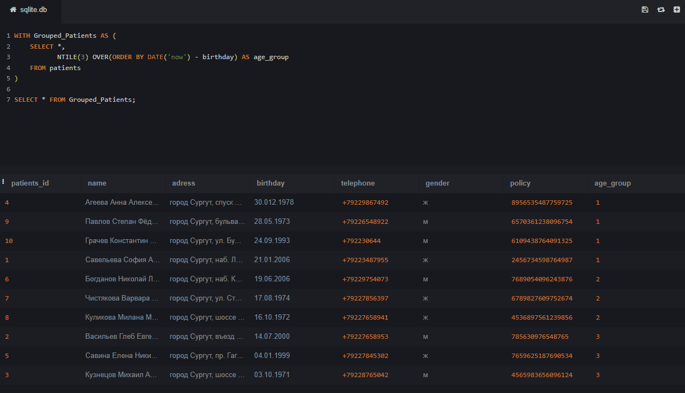

Этот код выдает таблицу со всеми данными пацентов и дополнительным столбцом "age_group", который указывает, к какой из трех возрастных групп относится пациент. Группы формируются на основе приблизительного возраста пацианта.

# Функции смещения:

### 1. LEAD

```
	SELECT
		doctors_id,

		LEAD(specialtions_id) OVER (PARTITION BY doctors_id ORDER BY specialtions_id) AS previous_specialtions

	FROM specialtions

```

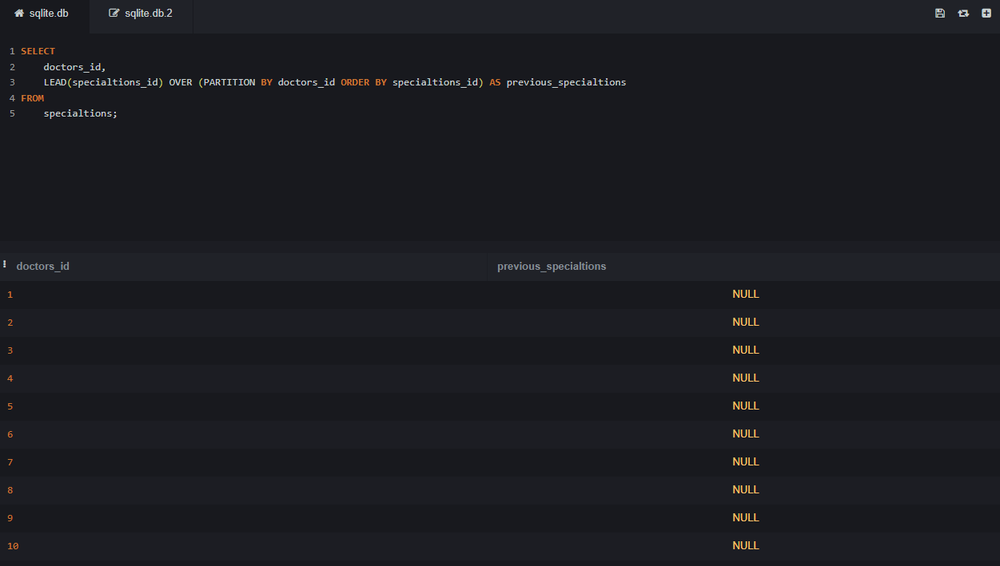

Этот запрос выводит идентификатор доктора и следующую специализацию для каждого врача в таблице "specialtions". Но т.к. в моей БД у докторов нет следующей специализации, в результате выводится NULL.

 
### 2. LAG

```
	SELECT
		patients_id,

		LAG(diagnosis) OVER (PARTITION BY patients_id ORDER BY sick_leaves_id) AS previous_diagnosis

	FROM sick_leaves


```

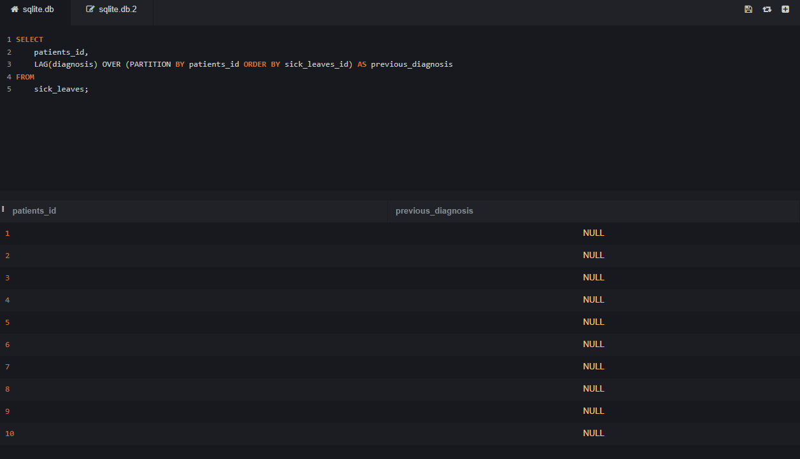


Этот запрос выводит идентификатор пациента и предыдущий диагноз для каждого пациента в таблице "sick_leaves". Но т.к. в моей БД у пациентов нет предыдущего диагноза, в результате выводится NULL.

# Демонстрация работы join:

### 1. INNER JOIN

```
	SELECT
		doctors.name,

		specialtions.name

	FROM doctors

		INNER JOIN specialtions ON doctors.doctors_id = specialtions.doctors_id


```

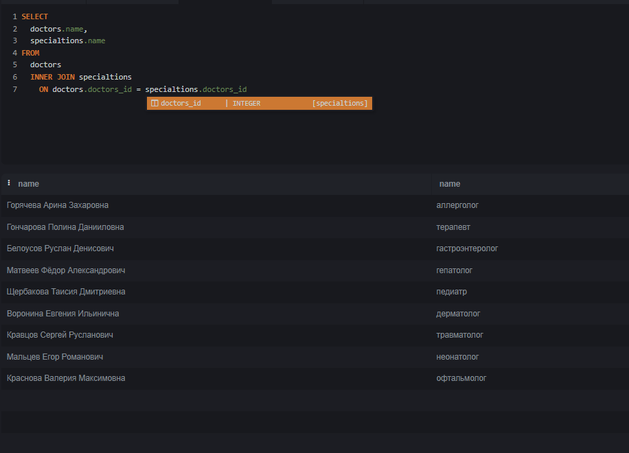

Оператору передаются таблицы patients и sick_leaves, и он возвращает их внутреннее пересечение по столбцам name и diagnosis. Результатом являются записи, которые соответствуют обеим таблицам , — их перед отправкой объединят.

### 2. LEFT JOIN

```
	SELECT
		patients.name,

		sick_leaves.diagnosis

	FROM patients

		LEFT JOIN sick_leaves ON patients.patients_id = sick_leaves.patients_id


```

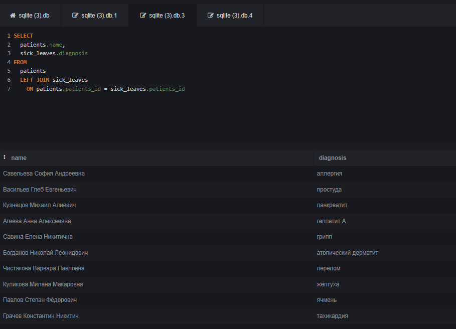

В финальном результате этого соединения попадают все записи из первой таблицы. И записи из второй таблицы, для которых выполняется условие объединения.

### 3. FULL JOIN

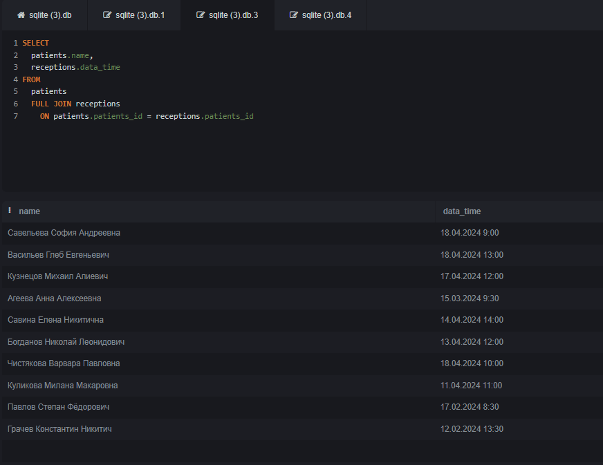

```
	SELECT
		patients.name,

		receptions.data_time

	FROM patients

		LEFT JOIN receptions ON patients.patients_id = receptions.patients_id

```

В финальном результате такого соединения попадют все записи из обеих таблиц. Независимо от того, выполняется условие объединения или нет.

### 4. RIGHT JOIN

```

	SELECT
		patients.name,

		receptions.complaints

	FROM patients

		LEFT JOIN receptions ON patients.patients_id = receptions.patients_id

```

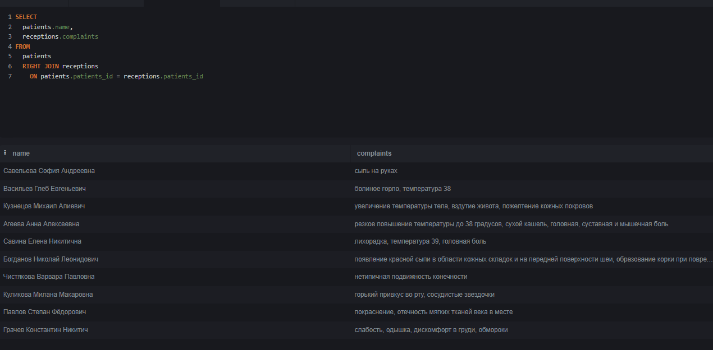

В финальном результате этого соединения попадют все записи из второй таблицы.И записи из первой таблицы, для которых выполняется условие объединения.

## Демонстрация работы функций CASE, WITH:

### 1. CASE

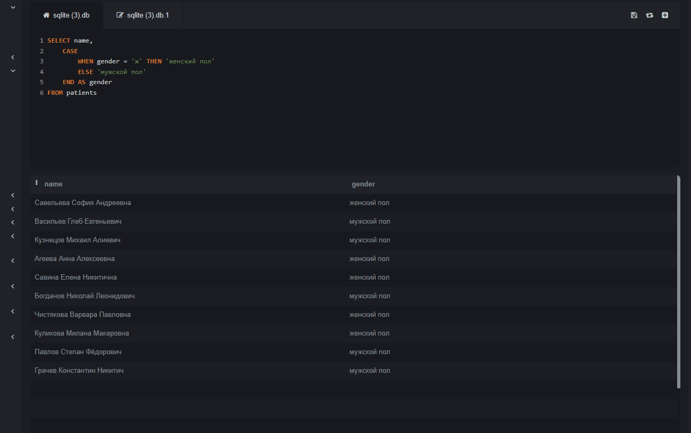

```

	SELECT name,

	CASE

	WHEN gender  = 'ж' THEN 'женский пол'

	ELSE 'мужской пол' END AS gender

	FROM  patients

```

Предполагается что в таблице "patients" есть столбца имя и пол с соответствующими данными. И этот код предпологает, что в столце пол есть только два возможных значения женский и мужской.В итоге этот код выводит имена пациентов и их пол.

### 1. WITH

```

	WITH hospital AS (SELECT name, adress FROM doctors)

	SELECT * FROM hospital

```

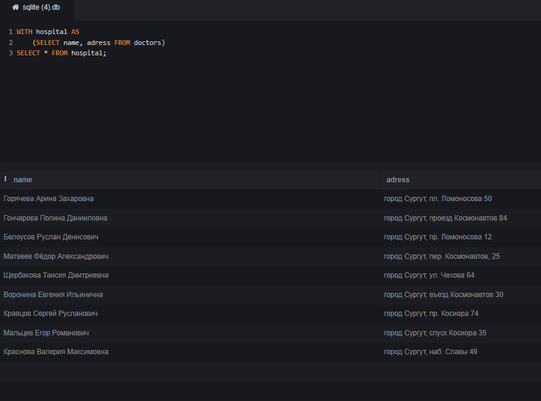

Этот код создает временню таблицу "hospital", которая содержит имена и адреса врачей, а затем выбирает все данные из этой временной таблицы и выводид их.


