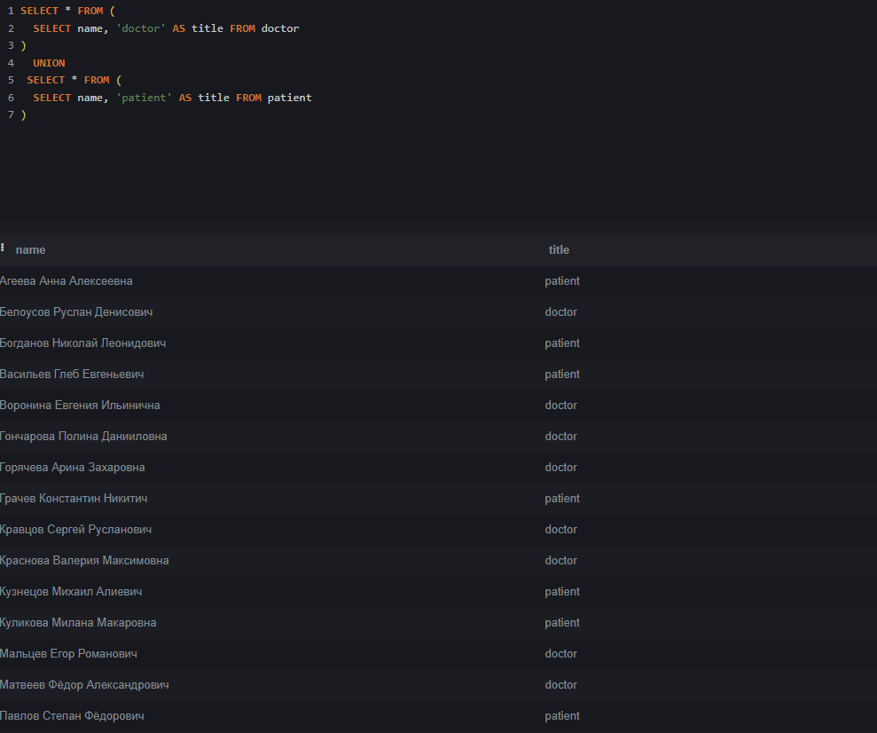

Калимуллина Анита Робертовна ИС-22-9/1

## Эта база данных моделирует информацию о больнице, включая данные о врачах, пациентах, специальностях и больничных листах, премах и расписаниях. 

## Сущности (Таблицы)

### 1. doctors

-doctors_id (INTEGER)

-name (TEXT)

-adress (TEXT)

-birthday (DATE)

-telephone(TEXT) 
       

### 2. patients

-patients_id(INTEGER)

-name(TEXT)  

-adress(TEXT)

-birthday(DATE)

-telephone(TEXT)

-gender(TEXT)

-policy (TEXT)

### 3. receptions

-receptions_id(INTEGER)

-patients_id(INTEGER)

-data_time(DATATIME)

-complaints(TEXT) 

-diagnosis(TEXT) 

### 4. schedules

-schedules_id(INTEGER)

-doctors_id(INTEGER)

-office_number(TEXT) 

-data_time(DATATIME)

### 5. sick_leaves

-doctors_id(INTEGER)

-patients_id(INTEGER)

-diagnosis(TEXT) 

### 6. specialtions

-doctors_id(INTEGER)

-name(TEXT) 

## Демонстрация работы функций:
1. UNION 

Этот запрос выбирает все имена из таблицы patients, из таблицы doctors и обьединяет их, удаляя дубликаты. В результате выполнения этого кода был получен список уникальных имен, которые встречаются либо в таблице doctors, либо в таблице patient.

2. ORDER BY

Этот запрос выбирате имена и дату рождения из таблицы patients и сортирует результаты по дате рождения в порядке убывания. В итоге, этот код выводит список пациентов, отсортированных по дате рождения.

3. HAVING

Это запрос выбирает диагнозы и id пациентов из таблицы sick_leaves, группирует результаты по столбцу diagnosis и фильтрует записи, оставляя только те, где значение столюца diagnosis = "грипп". В результате был получен id пациента который болеет гриппом.

4. SELECT 

Этот запрос выбирает id докторов и диагнозы из таблицы sick_leaves. В результате была получена таблица с id докторами и диагнозами которые они лечат.

5. WHERE
 

Этот запрос выбират имена из таблицы pateents и фильтрует имена, кторые не заканчиваютсяна букву "а". В итоге, мы получаем имена пациентов, которые не заканчиваются на букву "а".

## Демонстрация работы оконных функций:

# Агрегатные функции

1. COUNT

Этот запрос выбирает столбец name, подсчитывает количество строк для каждой группы с помощью COUNT и назначает результат псевдониму amount, все данные берутся из таблицы specialtions, группирует строки по значению столбца name, сортирует результат по столбцу amount. В результате этот код выдает список специализации с соответствующем количеством специалистов.

2. MAX 

