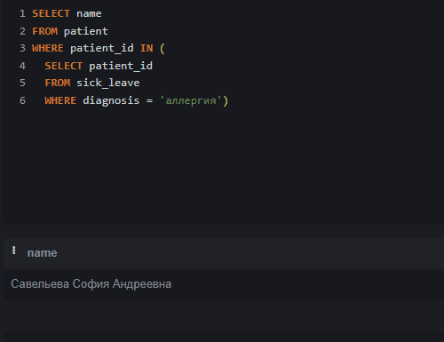
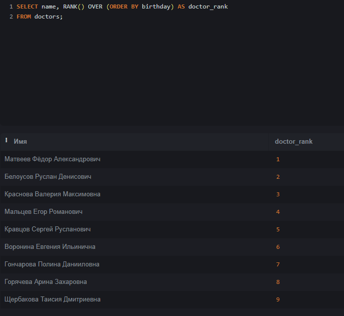

## Калимуллина Анита Робертовна ИС-22-9/1


# Эта база данных моделирует информацию о больнице, включая данные о врачах, пациентах, специальностях и больничных листах, премах и расписаниях. 


## Сущности (Таблицы)

### 1. doctor


- doctor_id (INTEGER PRIMARY KEY) - уникальный индефикатор доктора 

- name (TEXT) - фио доктора

- adres (TEXT) - адрес доктора

- birthday (DATE) - дата рождения доктора

- telephone (TEXT) - номер телефона доктора


### 2. patient


- patient_id (INTEGER PRIMARY KEY) - уникальный индефикатор доктора 

- name (TEXT) - фио пациента

- adres (TEXT) - адрес пациента

- birthday (DATE) - дата рождения пациента

- telephone (TEXT) - номер телефона пациента

- gender (TEXT) - пол пациента

- policy (TEXT) - номер страхового полиса пациента


### 3. reception


- reception_id (INTEGER PRIMARY KEY) - уникальный индефикатор приёма 

- patient_id (INTEGER) - индефикатор пациента, связан с таблицей patients по полю patients_id

- data_time (DATATIME) - дата и время приема пациента

- complaint (TEXT) - жалобы пациента

- diagnosis (TEXT) - диагноз пациента


### 4. schedule


- schedule_id (INTEGER PRIMARY KEY) - уникальный индефикатор расписания

- doctor_id (INTEGER) - индефикатор доктора, связан с таблицей doctors по полю doctors_id

- office_number (TEXT) - номер кабинета

- data_time (DATATIME) - дата и время приема в кабинете


### 5. sick_leave


- sick_leave_id (INTEGER PRIMARY KEY) - уникальный индефикатор больничного листа

- doctor_id (INTEGER) - индефикатор доктора, связан с таблицей doctors по полю doctors_id

- patient_id (INTEGER) - индефикатор пациента, связан с таблицей patients по полю patients_id

- diagnosis (TEXT) - диагноз пациента


### 6. specialtion


- specialtion (INTEGER PRIMARY KEY) - уникальный индефикатор специализации

- doctor_id (INTEGER) - индефикатор доктора, связан с таблицей doctors по полю doctors_id

- name (TEXT) - название специализации доктора


## Демонстрация работы функций:

### 1. UNION 

```
	SELECT name

		FROM doctor

		UNION

	SELECT name

		FROM patient
	
```


Этот запрос выбирает все имена из таблицы patients, из таблицы doctors и обьединяет их, удаляя дубликаты. В результате выполнения этого кода был получен список уникальных имен, которые встречаются либо в таблице doctors, либо в таблице patient.

### 2. ORDER BY

```

	SELECT name, birthday 

		FROM patient

	ORDER BY birthday DESC

```


Этот запрос выбирате имена и дату рождения из таблицы patients и сортирует результаты по дате рождения в порядке убывания. В итоге, этот код выводит список пациентов, отсортированных по дате рождения.

### 3. HAVING

```

	SELECT diagnosis, patient_id

		FROM sick_leave

	GROUP BY diagnosis

		HAVING diagnosis = 'грипп'

```


Это запрос выбирает диагнозы и id пациентов из таблицы sick_leaves, группирует результаты по столбцу diagnosis и фильтрует записи, оставляя только те, где значение столюца diagnosis = "грипп". В результате был получен id пациента который болеет гриппом.

### 4. SELECT 

```

	SELECT doctor_id, diagnosis

	FROM sick_leave

```



Этот запрос выбирает имена пациентов у которых в больничном листе указан диагноз аллергия и выводит их.
### 5. WHERE
 
```

	SELECT name

	FROM patient

	WHERE name NOT LIKE '%a'

```


Этот запрос выбират имена из таблицы pateents и фильтрует имена, кторые не заканчиваютсяна букву "а". В итоге, мы получаем имена пациентов, которые не заканчиваются на букву "а".

## Демонстрация работы оконных функций:

# Агрегатные функции:

### 1. COUNT

```

	SELECT name, COUNT (*) AS amount FROM specialtion

	GROUP BY name

	ORDER BY amount  DESC

```


Этот запрос выбирает столбец name, подсчитывает количество строк для каждой группы с помощью COUNT и назначает результат псевдониму amount, все данные берутся из таблицы specialtions, группирует строки по значению столбца name, сортирует результат по столбцу amount. В результате этот код выдает список специализации с соответствующем количеством специалистов.

### 2. MAX 

```
	SELECT MAX(length(name))

		AS самое_длинное_название_специальности 

	FROM specialtion
	
```


Этот запрос вычисляет длину в каждом значении столбца name и находит максимальное значение длины среди всех специализаций. В итоге этот код выводит число самого длинного названия специализации.

### 3. MIN 

```
	SELECT doctor_id, 
		
		MIN(data_time) AS самая_поздняя_запись_каждого_врача
	
	FROM schedules

	GROUP BY doctor_id
	
```


Этот запрос выбирает id врача и находит минимальное значение столбца data_time. В результате этот код выводит id врачей и самую позднюю запись для каждого врача.

# Ранжирующие функции:

### 1. RANK

```

	SELECT name, RANK() OVER (ORDER BY birthday) AS doctor_rank

	FROM doctor

```



Этот запрос выбирает имена врачей и присваевает ранг каждому врачу на основе их даты рождения. В итоге, выводятся имена врачей и ранг присвоенный каждому врачу.

### 2. DENSE_RANK

```

	WITH Numbered_Patient AS (

		SELECT *,

			DENSE_RANK() OVER(ORDER BY birthday) AS rank

		FROM patient )

	SELECT * FROM Numbered_Patient

```


Этот код выдает таблицу со всеми данными пациентов, а также дополнительный столбец "rank" котогрый содержит уникальный номер для каждого пациента, основанный на их дате рождения.

### 3. ROW_NUMBER

```

	WITH Numbered_Doctor AS (

		SELECT *,
		
		ROW_NUMBER() OVER(ORDER BY birthday DESC) AS row_num

		FROM doctor )

	SELECT * FROM Numbered_Doctor

```


Этот код выдает таблицу со всеми данными врачей, а также дополнительный столбец "row_num" котогрый содержит уникальный номер для каждого врача, основанный и отсортированный по их дате рождения.

### 4. NTILE

```

	WITH Grouped_Patient AS (

		SELECT *,

			NTILE(3) OVER(ORDER BY DATE('now') - birthday) AS age_group

		FROM patient )

	SELECT * FROM Grouped_Patient

```


Этот код выдает таблицу со всеми данными пацентов и дополнительным столбцом "age_group", который указывает, к какой из трех возрастных групп относится пациент. Группы формируются на основе приблизительного возраста пацианта.

# Функции смещения:

### 1. LEAD

```
	SELECT
		doctor_id,

		LEAD(specialtions_id) OVER (PARTITION BY doctors_id ORDER BY specialtions_id) AS previous_specialtions

	FROM specialtion

```


Этот запрос выводит идентификатор доктора и следующую специализацию для каждого врача в таблице "specialtions". Но т.к. в моей БД у докторов нет следующей специализации, в результате выводится NULL.

 
### 2. LAG

```
	SELECT
		patient_id,

		LAG(diagnosis) OVER (PARTITION BY patient_id ORDER BY sick_leave_id) AS previous_diagnosis

	FROM sick_leave


```


Этот запрос выводит идентификатор пациента и предыдущий диагноз для каждого пациента в таблице "sick_leaves". Но т.к. в моей БД у пациентов нет предыдущего диагноза, в результате выводится NULL.

# Демонстрация работы join:

### 1. INNER JOIN

```
	SELECT
		doctor.name,

		specialtion.name

	FROM doctor

		INNER JOIN specialtion ON doctor.doctor_id = specialtion.doctor_id


```


Оператору передаются таблицы patients и sick_leaves, и он возвращает их внутреннее пересечение по столбцам name и diagnosis. Результатом являются записи, которые соответствуют обеим таблицам , — их перед отправкой объединят.

### 2. LEFT JOIN

```
	SELECT
		patient.name,

		sick_leave.diagnosis

	FROM patient

		LEFT JOIN sick_leave ON patient.patient_id = sick_leave.patient_id


```


В финальном результате этого соединения попадают все записи из первой таблицы. И записи из второй таблицы, для которых выполняется условие объединения.

### 3. FULL JOIN


```
	SELECT
		patient.name,

		reception.data_time

	FROM patient

		LEFT JOIN reception ON patient.patient_id = reception.patient_id

```

В финальном результате такого соединения попадют все записи из обеих таблиц. Независимо от того, выполняется условие объединения или нет.

### 4. RIGHT JOIN

```

	SELECT
		patient.name,

		reception.complaint

	FROM patient

		LEFT JOIN reception ON patient.patient_id = reception.patient_id

```


В финальном результате этого соединения попадют все записи из второй таблицы.И записи из первой таблицы, для которых выполняется условие объединения.

## Демонстрация работы функций CASE, WITH:

### 1. CASE


```

	SELECT name,

	CASE

	WHEN gender  = 'ж' THEN 'женский пол'

	ELSE 'мужской пол' END AS gender

	FROM  patient

```

Предполагается что в таблице "patients" есть столбца имя и пол с соответствующими данными. И этот код предпологает, что в столце пол есть только два возможных значения женский и мужской.В итоге этот код выводит имена пациентов и их пол.

### 1. WITH

```

	WITH hospital AS (SELECT name, adress FROM doctor)

	SELECT * FROM hospital

```


Этот код создает временню таблицу "hospital", которая содержит имена и адреса врачей, а затем выбирает все данные из этой временной таблицы и выводид их.


